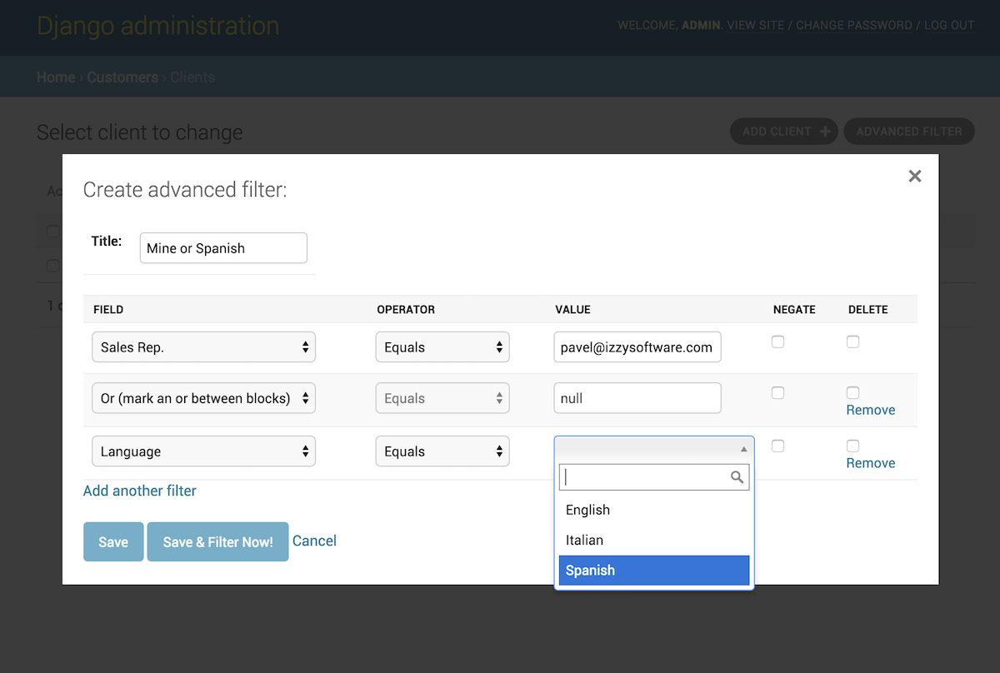

## Django Advanced Filters

A django ModelAdmin mixin which adds advanced filtering abilities to the admin.

Mimics the advanced search feature in [VTiger](https://www.vtiger.com/),
[see here for more info](https://wiki.vtiger.com/index.php/Create_Custom_Filters)

For release notes, see [Changelog](CHANGELOG.md)

### TODO

* Add more tests (specifically the form and view parts)
* ~~Add packaging (setup.py, etc...)~~
* ~~Add edit/view functionality to the filters~~
* Add permission user/group selection functionality to the filter form

## Requirements

* Django >= 1.5  (tested in 1.5 and 1.7, should work in 1.6 too)
* django-easy-select2 == 1.2.5
* django-braces == 1.4.0
* simplejson == 3.6.5

## Set up

1. Add both `'advanced_filters'` and `'easy_select2'` to `INSTALLED_APPS`.
2. Add `url(r'^advanced_filters/', include('advanced_filters.urls'))` to your project's urlconf.
3. Run `python manage.py syncdb`

## Integration Example

Extending a ModelAdmin is pretty straightforward:

    class ProfileAdmin(AdminAdvancedFiltersMixin, models.ModelAdmin):
        list_filter = ('name', 'language', 'ts')   # simple list filters

        # select from these fields in the advanced filter creation form
        advanced_filter_fields = (
            'name', 'language', 'ts'
            # even use related fields as lookup fields
            'country__name', 'posts__title', 'comments__content'
        )

Adding a new advanced filter (see below) will display a new list filter
named "Advanced filters" which will list all the filter the currently
logged in user is allowed to use (by default only those he/she created).

### Custom naming of fields

Initially, each field in `advanced_filter_fields` is resolved into an actual
model field. That field's verbose_name attribute is then used as the text
of the displayed option. While uncommon, it occasionally makes sense to
use a custom name, especially when following a relationship, as the context
then changes.

For example, when a profile admin allows filtering by a user name as well as
a sales representative name, it'll get confusing:

    class ProfileAdmin(AdminAdvancedFiltersMixin, models.ModelAdmin):
      advanced_filter_fields = ('name', 'sales_rep__name')

In this case the field options will both be named "name" (by default).

To fix this, use custom naming:

    class ProfileAdmin(AdminAdvancedFiltersMixin, models.ModelAdmin):
      advanced_filter_fields = ('name', ('sales_rep__name', 'assigned rep'))

Now, you will get two options, "name" and "assigned rep".

## Adding new advanced filters

By default the mixin uses a template which extends django's built-in
`change_list` template. This template is based off of grapelli's
fork of this template (hence the 'grp' classes and funny looking javascript).

The default template also uses the superb [magnificPopup](dimsemenov/Magnific-Popup)
which is currently bundled with the application.

Regardless of the above, you can easily write your own template which uses
context variables `{{ advanced_filters }}` and
`{{ advanced_filters.formset }}`, to render the advanced filter creation form.

Here's a screenshot

## Structure

Each advanced filter has only a couple of required fields when constructed
with the form; namely the title and a formset (consisting of a form for each
sub-query or rule of the filter query).

Each form in the formset requires the following fields:
`field`, `operator`, `value`

And allows the optional `negate` and `remove` fields.

Let us go over each of the fields in a rule fieldset.

### Field

The list of all available fields for this specific instance of the ModelAdmin
as specific by the [`advanced_filter_fields` property.](#integration-example)

#### The OR field

`OR` is an additional field that is added to every rule's available fields.

It allows constructing queries with [OR statements](https://docs.djangoproject.com/en/dev/topics/db/queries/#complex-lookups-with-q-objects). You can use it by creating an "empty" rule with this field "between" a set of 1 or more rules.

### Operator

Query field suffixes which specify how the `WHERE` query will be constructed.

The currently supported are as follows:
`iexact`, `icontains`, `iregex`, `range`, `isnull`, `istrue` and `isfalse`

For more detail on what they mean and how they function, see django's
[documentation on field lookups](https://docs.djangoproject.com/en/dev/ref/models/querysets/#field-lookups).

### Value

The value which the specific sub-query will be looking for, i.e the
value of the field specified above, or in django query syntax: `.filter(field=value)`

### Negate

A boolean (check-box) field to specify whether this rule is to be negated,
effectively making it a "exclude" sub-query.

### Remove

Similarly to other [django formsets](https://docs.djangoproject.com/en/dev/topics/forms/formsets/),
used to remove the formset on submit.

## Editing previously created advanced filters

The `AdvancedFilterAdmin` class (a subclass of `ModelAdmin`) is provided
and registered with `AdvancedFilter` in admin.py module.

The model's change_form template is overridden from grapelli's/django's
standard template, to mirror the add form modal as closely as possible.

*Note:* currently, adding new filters from the ModelAdmin change page
is not supported.

## Query Serialization

**TODO:** write a few words on how serialization of queries is done.

## Model correlation

Since version 1.0, The underlying `AdvancedFilter` model instances are tightly
coupled with a specific model (using the app_label.Name model name),
for which admin changelist they are to used and created in.

This change has a few benefits:

1. Admin mixin can be used with multiple `ModelAdmin` classes while performing
   specific query serialization and field validation that are at the base of the
   filter functionality.

2. Allows users to edit previously created filters outside of
   the context of a changelist, as we do in the [`AdvancedFilterAdmin`](#editing-previously-created-advanced-filters).

3. Limit the `AdvancedListFilters` to limit queryset (and thus, the underlying
   options) to a specified model.

Note: Since we are at the early stages of development I have skipped the
South / 1.7 schema (new field) and data migrations (add specific model to all
existing instances of AdvancedFilter model) migrations. Though this shouldn't
be too difficult to do, if the need arises I can add migration examples.

## Views

The GetFieldChoices view is required to dynamically (using javascript) fetch a
list of valid field choices when creating/changing an `AdvancedFilter`.

